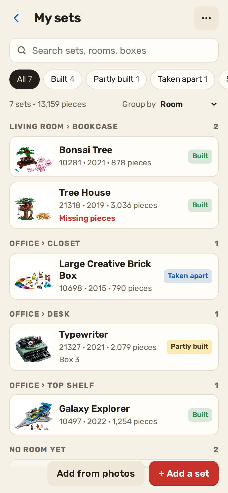
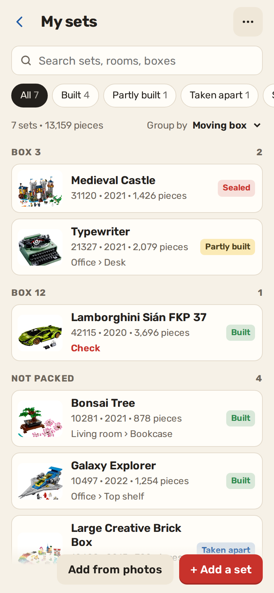
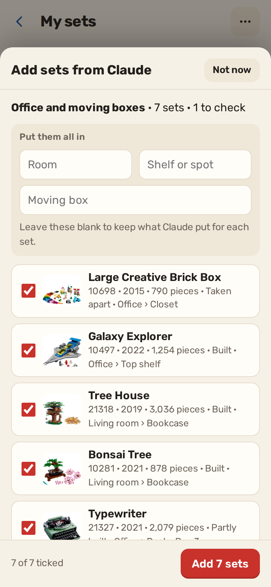
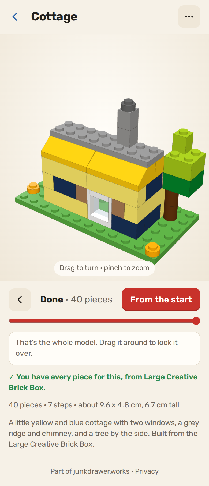

# Brickyard

**Use it: [brickyard.junkdrawer.works](https://brickyard.junkdrawer.works/)**

**A home for your LEGO: every set you own, where it is, and whether it's built.** Send Claude photos of your set boxes or built models, open the link it gives you, and the sets are in. While you're moving, it tracks which box each set is packed in.

<p align="center">
  
  &nbsp;
  
  &nbsp;
  
</p>

Brickyard is one app with three parts, all reading from the same catalog: **My sets**; **Build from your box**, where Claude designs a new model from only the pieces you own, Brickyard checks you can really build it, and shows it in 3D step by step; and the **Shelf planner**, which fits your built sets onto your bookcases.

## How it works

- **A catalog of sets.** For each set it keeps the number, name, year, piece count and theme; where it is (a room and shelf, or a moving box); whether it's built, partly built, taken apart or sealed; missing pieces; whether you have the paper instructions; its built size, for the shelf planner; tags and notes.
- **Add from photos.** Claude reads the set numbers off boxes and instruction books, or recognises built models, and makes a Brickyard link. Opening it shows the list first: sets you already own are unticked, anything Claude wasn't sure of is marked **Check**, and you can put the whole batch in one room, shelf or moving box before tapping **Add**.
- **Find things.** Search covers every field, and "box 3" finds what's packed in box 3. Filter by state, missing pieces or to check, and group by room, moving box, theme or state.
- **Pictures** of each set come from [Rebrickable](https://rebrickable.com/) by set number. Turn them off in the menu and nothing leaves your browser.
- **Backups.** Download the whole catalog as a file and open it on another device (it merges), or download a spreadsheet (CSV).
- No account and no server. Your catalog stays in your browser. It works offline and installs to a phone's home screen.

## Adding sets with Claude

`skill/brickyard-cataloger/` is a skill for Claude. Send it photos of your sets and it identifies each one, checks the set numbers, and hands them to Brickyard as a link and a `.brickyard.json` file. Its script also runs on its own:

```sh
python3 skill/brickyard-cataloger/scripts/make_brickyard.py sets.json
```

`skill/brickyard-cataloger/references/brickyard-format.md` describes the link, batch and backup formats.

## Build from your box

<p align="center"></p>

- **Your pieces** are the parts lists of the sets in My sets that are taken apart (tick or untick each one). Brickyard has a parts list for the Large Creative Brick Box (10698) so far; `parts/sets/` holds one file per set and `parts/index.json` lists them, so adding a set is adding its list there.
- **Copy my pieces for Claude** copies the whole pool as `part/colour ×count`. Paste it to Claude with what you'd like built.
- **Models** from Claude open from a link (`#d1z…`) or a pasted file, and stay in this browser. Each one is checked against your pieces: enough of every part in every colour, nothing overlapping, everything joined by studs, and every step joining onto what's built. A 3D view (three.js, in `js/vendor/`) shows each step with the pieces to find.
- `skill/brickyard-designer/` is the skill Claude designs with. Its script does the same checks as the page and makes the link:

```sh
python3 skill/brickyard-designer/scripts/check_model.py model.json --layers
```

## Shelf planner

- **Bookcases**: add each one with its inside width and depth and the clear height of each shelf (presets for an IKEA Billy, a narrow Billy and a Kallax column). Each is drawn from the front, to scale, with your sets on it.
- **Fit the sets onto the shelves** places every built or partly built set that isn't on a shelf yet: tallest first, each on the shortest shelf that takes it, facing out, or side-on when only that fits. Sets already placed stay put. Anything that doesn't fit says why (too tall, too deep, no room left).
- Tap a set to move it to another shelf, turn it side-on, move it left or right, or fix its size. **Put these places in My sets** copies each set's room and shelf into the catalog.
- **Sizes**: the planner needs each set's built width, depth and height. **Copy these for Claude** sends Claude the sets without one; it answers with a sizes link (`#z1z…`) that fills them in after you review them.
- Bookcases are saved with the catalog, so backups and merges carry them.

## Running it

It's a static site: plain HTML, CSS and JavaScript, with no build step.

```sh
npx serve .                   # or any static file server, then open the printed address
npm test                      # unit tests, then uses it in Chromium through the real page (needs Playwright)
node tools/screenshots.mjs    # redraws docs/*.png and og.png (PICS=folder of thumbnails for set pictures)
node tools/make-icons.mjs     # redraws the PNG icons from icon.svg
```

To put it online with GitHub Pages: **Settings → Pages → Build and deployment → Deploy from a branch**, then pick `main` and `/ (root)`. The `CNAME` file serves it at brickyard.junkdrawer.works.

### Files

- `index.html`: the home screen, the catalog, the builder and the shelf planner.
- `js/core.js`: cleaning sets, merging catalogs, finding doubles, search, links and the spreadsheet. No DOM, so the tests run it in Node.
- `js/app.js`: the screens, sheets and storage (`brickyard.v1` in localStorage).
- `js/build-core.js`: the builder's checks and model links, no DOM; `js/build.js`: the builder's screens and 3D view.
- `js/shelf-core.js`: the shelf planner's fitting and sizes links, no DOM; `js/shelves.js`: its screen and drawings.
- `parts/`: part shapes on the stud grid, LDraw colours, and each set's parts list. `models/`: the example cottage.
- `css/app.css`: light and dark palettes.
- `skill/brickyard-cataloger/`, `skill/brickyard-designer/`: the Claude skills and their scripts.
- `test/core.test.cjs`, `test/build.test.cjs`, `test/shelf.test.cjs`, `test/e2e.mjs`: the tests; `test/fixtures/sample.json` is the sample batch the tests and screenshots use.
- `fonts/`: Rubik (SIL Open Font License, `fonts/OFL.txt`), served from here so nothing loads from elsewhere.
- `sw.js`: keeps a copy for using offline.

## License

MIT — see [LICENSE](LICENSE).
